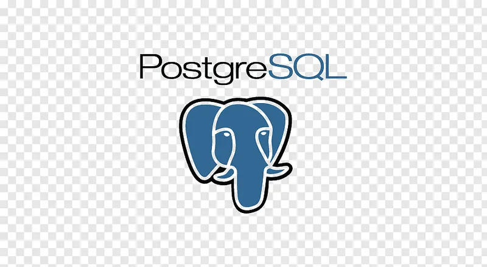
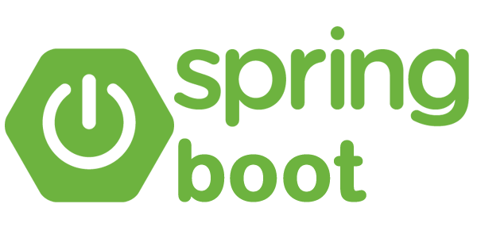
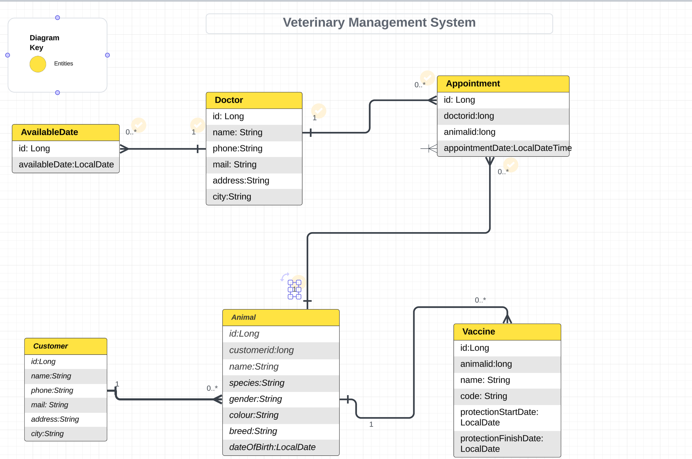

# Technologies used in the project: Java, Spring Boot, Postgre SQL

<table>
  <tr>
    <td align="center" >
      <b>JAVA</b>
    </td>
    <td align="center" style="padding-top: 15px;">
      
    </td>
  </tr>
 <tr>
    <td align="center" >
      <b>POSTGRE SQL</b>
    </td>
    <td align="center" style="padding-top: 15px;">
      
    </td>
  </tr>
 <td align="center" >
      <b>SPRİNT BOOT</b>
    </td>
    <td align="center" style="padding-top: 15px;">
      
    </td>
  </tr>
</table>

# Veterinary System

The veterinary management system project is designed as API through which a veterinary clinic can manage its own affairs. It is intended to make it easy for the veterinarian, staff and clients to handle their transactions. Customizations such as animal vaccination information, appointment creation and vet availability have been made.

# When creating this application, the relationships with the uma diagram were determined

# Operations designed for users

<h2>Management of Animals and their Owners </h2>

<ul>
<li>Registering, updating, viewing and deleting animals</li>
<li>Registering, updating, viewing and deleting animal owners</li>
<li>Animal owners filter by name</li>
<li>Filter animals by name</li>
<li>Creating the API end point to view all the animals of the animal owner registered in the system.</li>
</ul>

<h2>Management of administered vaccines</h2>

<ul>
<li>Record, update, view and delete information about vaccines administered to animals</li>
<li>If the vaccine protection expiry date of the same type of vaccine (vaccine with the same name and code) for the patient has not yet arrived, no new vaccine should be entered into the system.</li>
<li>Creating the API end point to list all vaccination records for a specific animal by animal id.</li>
<li>To create an API end point that returns a list of animals with vaccine protection dates in this range according to the start and end dates entered by the user so that the user can list the animals whose vaccine protection end date is approaching.</li>
</ul>

<h2>Appointment Management</h2>

<ul>
<li>Creating, updating, viewing and deleting vaccination and examination appointments for animals</li>
<li>Appointments should be made with doctors for all kinds of examinations of animals on appropriate dates and times.</li>
</ul>

<h2>Veterinary Doctor Management</h2>

<ul>
<li>Registering, updating, viewing and deleting veterinary doctors</li>
</ul>

<h2>Management of Doctors' Available Days</h2>
<ul>
<li>Add, update, view and delete doctors' available days</li>

</ul>

<h2>Endpoint</h2>

To check endpoints of the project, you can take a look at the (endpoint.md) file.
